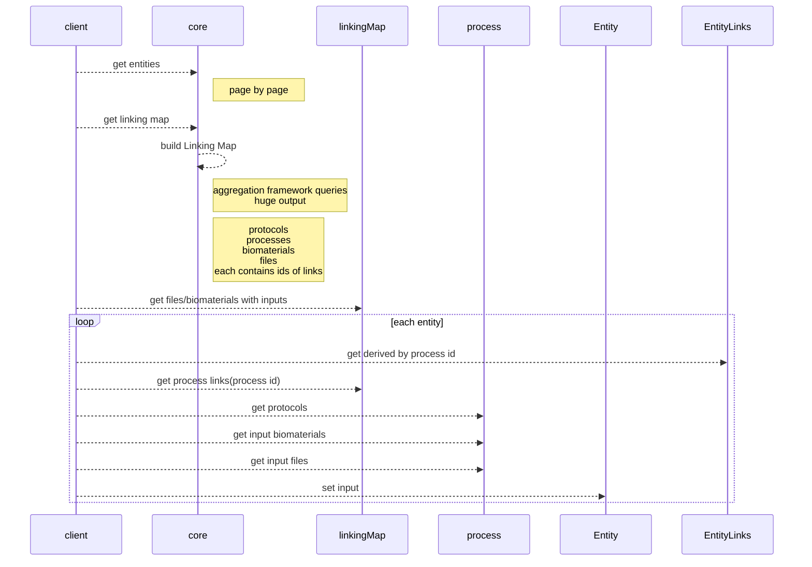
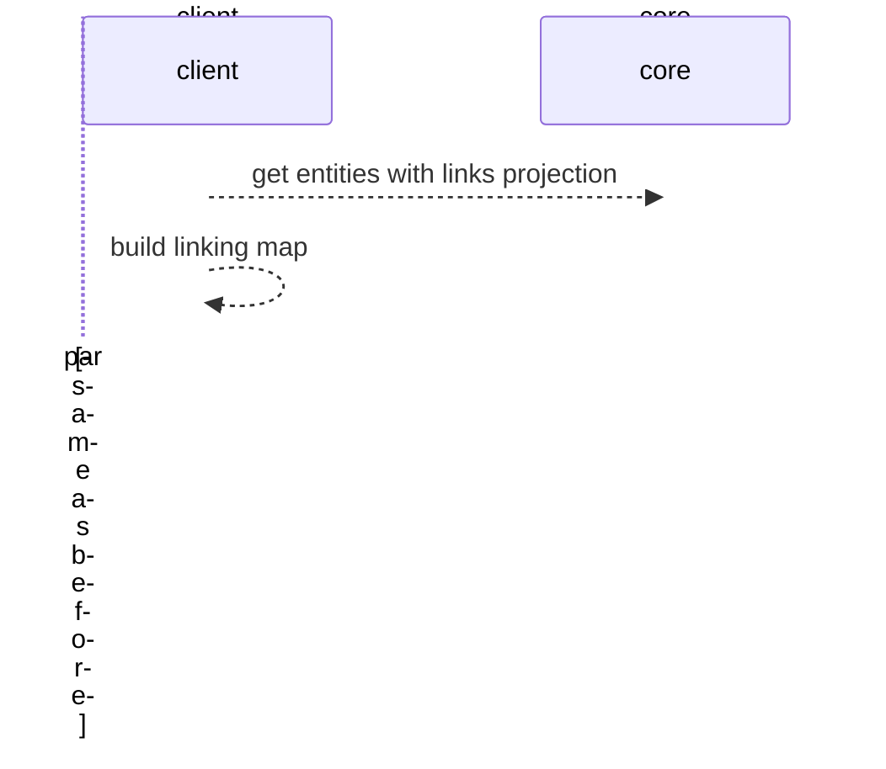

# Current

```mermaid
sequenceDiagram
    participant client
    participant core 
    participant linkingMap
    participant process
    participant Entity
    participant EntityLinks
        
    client -->> core: get entities
    note right of core: page by page
    client -->> core: get linking map
    core -->> core: build Linking Map
    note right of core: aggregation framework queries<br/>huge output
    note right of core: protocols<br/>processes<br/>biomaterials<br/>files<br/>each contains ids of links
    client -->> linkingMap: get files/biomaterials with inputs
    loop each entity
        client -->> EntityLinks: get derived by process id
        client -->> linkingMap: get process links(process id)
        client -->> process: get protocols
        client -->> process: get input biomaterials
        client -->> process: get input files
        client -->> Entity: set input
    end
```

# Suggested

Advantages:
- avoids 2nd call to linking map

Disadvantages:
- still loads the entire entity dictionary (id->entity) to memory

```mermaid
sequenceDiagram
    participant client
    participant core

    client -->> core: get entities with links projection
    client -->> client: build linking map
    
    par same as before 
        
    end
    
```